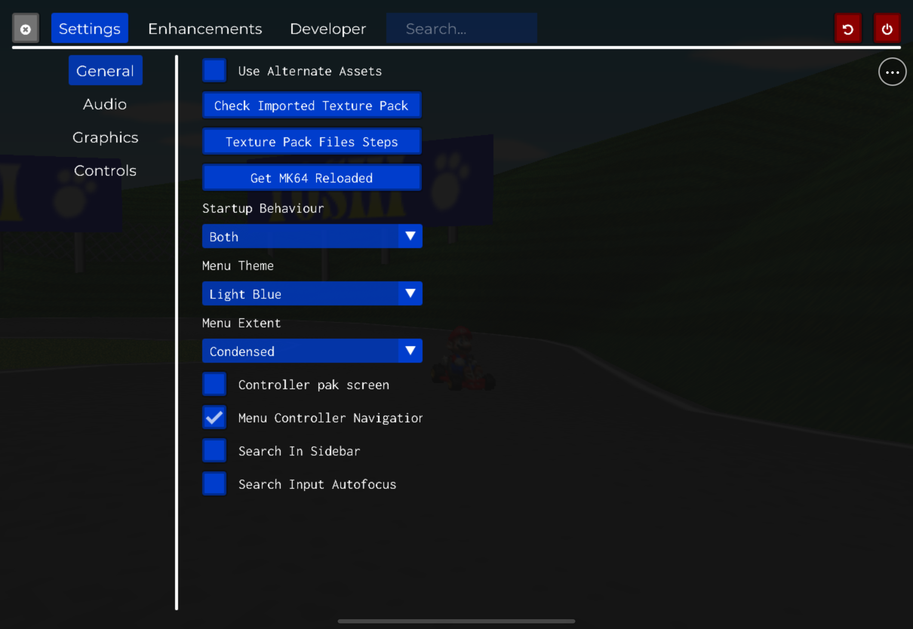
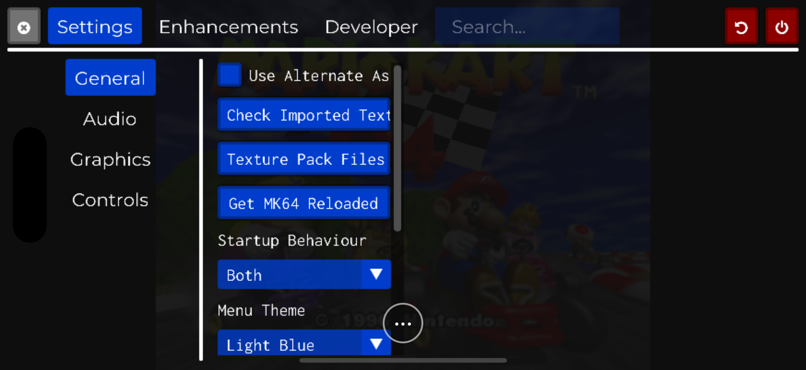
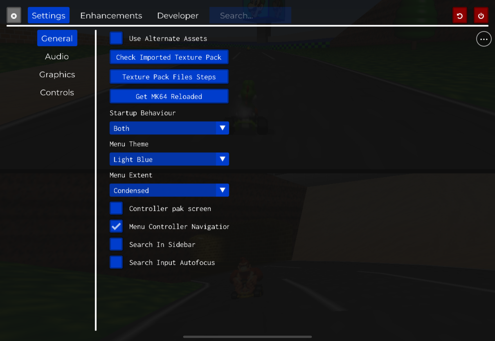

  

<h1 align="center">SpaghettiPad</h1>

  Mario Kart 64, rebuilt as a native iPad experience—with full-analog touch
  steering, an iPhone layout of its own, and multiplayer on one screen as the
  destination.

> **Development preview:** the native iPadOS/iOS Simulator build is playable
> through touch and the bring-your-own-ROM flow, and two-controller horizontal
> split-screen now runs in the iPad Simulator. Physical-iPad validation,
> Bluetooth-controller performance, tilt steering, packaging, and release
> artifacts are still in progress. There is no public IPA yet.

## Made for the screen in your hands

SpaghettiPad is not a desktop port squeezed onto a tablet. Its controls sit
along the low grip rails, steering remains genuinely analog, empty overlay
space stays transparent to the game, and every N64 input—including the full
four-button C diamond—is available without a keyboard.

- **iPad-first controls.** A low, two-hand layout derived from the latest
  HarkinianPad control system, adapted for kart racing.
- **A real iPhone layout.** Compact controls use their own geometry and the
  game renders at the phone's native wide aspect ratio without stretching.
- **Bring your own game.** A legally acquired US 1.0 big-endian `.z64` stays
  in the app's Files-visible container and is extracted locally.
- **Couch multiplayer in progress.** Two controllers now receive independent
  player ports and render horizontal split-screen in the iPad Simulator. The
  two-Bluetooth-controller hardware and frame-time gate is still open.
- **Optional visual upgrades.** Import a compatible `.o2r` through Files,
  detect it in-app, and enable Alternate Assets without a desktop file picker.
  No third-party pack is bundled, fetched, mirrored, or redistributed.

## One app, two tailored layouts

The same app runs on iPad and iPhone, but it does not pretend they are the
same shape. iPad gets a roomy 2× interface and low grip controls; iPhone gets
a compact 0.75× interface, its own control geometry, and native wide
rendering.

<table>
  <tr>
    <td width="50%"></td>
    <td width="50%"></td>
  </tr>
  <tr>
    <td align="center">iPad</td>
    <td align="center">iPhone</td>
  </tr>
</table>

## Two racers, one iPad

SpaghettiPad assigns controllers by connection order: the first controller is
player one, the second is player two, and so on. When any physical controller
is present, the touch controller parks itself instead of sharing player one's
inputs. Disconnect the last controller and the touch controller returns.

Live two-player versus rendering in the iPad Simulator. The menu is left open to show that the touch overlay is parked; physical-iPad performance proof is still pending.

## Where it stands

| Capability | Current proof |
|---|---|
| Native Metal iPadOS/iOS app | Release arm64 Simulator build passes |
| iPad touch controls | Full layout, analog telemetry, menus, and lifecycle release pass in Simulator |
| iPhone support | Dedicated compact controls and native widescreen pass in Simulator |
| Files import and extraction | Recovery and relaunch pass in Simulator; physical-device timing remains |
| Optional texture packs | Import, validation, enable, and persistence workflow passes with a ROM-free test archive in Simulator; real-pack hardware GP pending |
| Audio and lifecycle | Three-cycle Simulator continuity plus human-confirmed audible resume |
| Physical iPad | Signing, installation, stability, and touch-only Grand Prix pending |
| Controllers and split-screen | Independent ports, parked touch input, four-port defaults, and live 2P horizontal rendering pass in Simulator; two-controller hardware GP/frame-time capture pending |
| Tilt steering | Planned validation phase |
| Unsigned ROM-free IPA | Final packaging phase |

The proof log is intentionally strict: a Simulator result never stands in for
a physical-device result. Follow the live
[remaining-work queue](docs/remaining-work.md) for exact evidence and open
gates.

## How the project is built

SpaghettiPad is a small, reviewable patch overlay rather than a fork with
untraceable engine changes:

1. Pin upstream
   [SpaghettiKart](https://github.com/HarbourMasters/SpaghettiKart),
   [libultraship](https://github.com/Kenix3/libultraship), and
   [Torch](https://github.com/HarbourMasters/Torch) revisions.
2. Apply the maintained iOS, extraction, touch, and device-UX patches in order.
3. Compile the repo-owned Objective-C++ app shell and asset catalog into the
   native app.
4. Audit the product for ROMs, generated game archives, imported textures,
   signing residue, and platform mistakes before packaging.

The implementation is JIT-free, ROM-free, and designed for reproducible clean
replay. Developer build and sideload instructions will be published once the
physical-device and packaging gates pass.

## Bring your own assets

This repository does **not** contain Mario Kart 64, extracted Nintendo assets,
`mk64.o2r`, or MK64 Reloaded. You must supply your own legally acquired
Mario Kart 64 (US 1.0) ROM. Texture packs remain optional, user-imported
content and are never part of the app or release artifact.

For an optional visual upgrade, SpaghettiPad links to the official
[MK64 Reloaded](https://evilgames.eu/texture-packs/mk64-reloaded.htm) project
page from Settings. Download the SpaghettiKart HD `.o2r` yourself, move it in
Files to `On My iPad > SpaghettiPad > mods`, relaunch once, then use
**Check Imported Texture Pack**. Start with HD; 4K remains a physical
M-series-iPad performance experiment, not a default recommendation.

## Read the work

- [Implementation plan](docs/spaghettikart-implementation-plan.md)
- [Current queue and proof log](docs/remaining-work.md)
- [iOS feasibility study](docs/spaghettikart-ios-feasibility.md)
- [Prior-port review and claim boundaries](docs/rebelancap-ports-review.md)

## Credits and legal

SpaghettiPad builds on the work of the SpaghettiKart, libultraship, Torch, and
HarkinianPad contributors.

This is an independent, non-commercial source-port project. Nintendo, Mario,
and Mario Kart are trademarks of Nintendo. SpaghettiPad is not affiliated
with, endorsed by, or sponsored by Nintendo. No copyrighted game content is
distributed by this repository.
