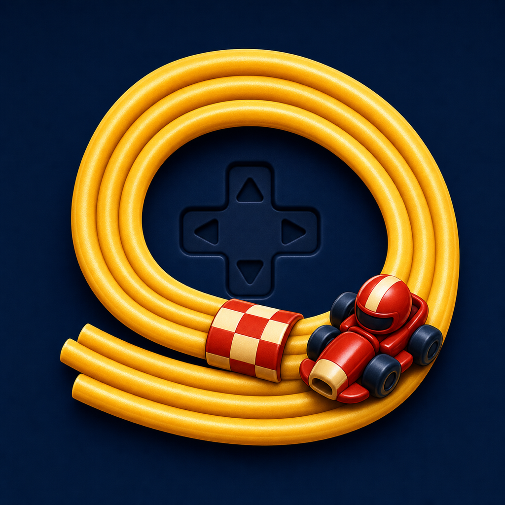
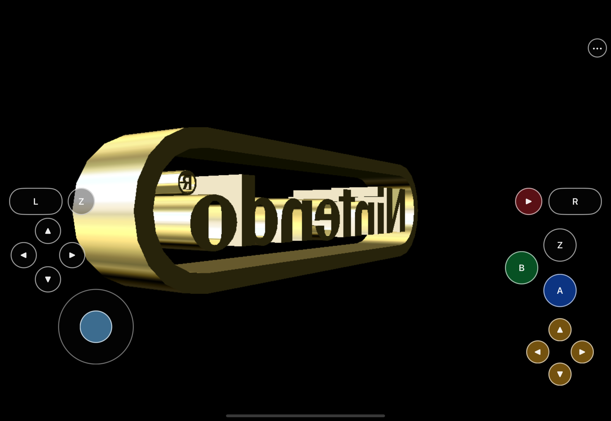

  

<h1 align="center">SpaghettiPad</h1>

  Mario Kart 64, rebuilt as a native iPad experience—with full-analog touch
  steering, an iPhone layout of its own, and multiplayer on one screen as the
  destination.

> **Development preview:** the native iPadOS/iOS Simulator build is playable
> through touch and the bring-your-own-ROM flow. Physical-iPad validation,
> controller split-screen, tilt steering, packaging, and release artifacts are
> still in progress. There is no public IPA yet.

## Made for the screen in your hands

SpaghettiPad is not a desktop port squeezed onto a tablet. Its controls sit
along the low grip rails, steering remains genuinely analog, empty overlay
space stays transparent to the game, and every N64 input—including the full
four-button C diamond—is available without a keyboard.

- **iPad-first controls.** A low, two-hand layout derived from the latest
  HarkinianPad control system, adapted for kart racing.
- **A real iPhone layout.** Compact controls use their own geometry and the
  game renders at the phone's native wide aspect ratio without stretching.
- **Bring your own game.** A legally acquired US 1.0 big-endian `.z64` stays
  in the app's Files-visible container and is extracted locally.
- **Built toward couch multiplayer.** SpaghettiKart's native split-screen is
  the foundation for the planned two-controller, one-iPad experience.
- **Optional visual upgrades.** User-imported `.o2r` texture packs are planned;
  no third-party pack is bundled or redistributed.

## Where it stands

| Capability | Current proof |
|---|---|
| Native Metal iPadOS/iOS app | Release arm64 Simulator build passes |
| iPad touch controls | Full layout, analog telemetry, menus, and lifecycle release pass in Simulator |
| iPhone support | Dedicated compact controls and native widescreen pass in Simulator |
| Files import and extraction | Recovery and relaunch pass in Simulator; physical-device timing remains |
| Audio and lifecycle | Three-cycle Simulator continuity plus human-confirmed audible resume |
| Physical iPad | Signing, installation, stability, and touch-only Grand Prix pending |
| Controllers and split-screen | Planned validation phase |
| Tilt steering | Planned validation phase |
| Unsigned ROM-free IPA | Final packaging phase |

The proof log is intentionally strict: a Simulator result never stands in for
a physical-device result. Follow the live
[remaining-work queue](docs/remaining-work.md) for exact evidence and open
gates.

## How the project is built

SpaghettiPad is a small, reviewable patch overlay rather than a fork with
untraceable engine changes:

1. Pin upstream
   [SpaghettiKart](https://github.com/HarbourMasters/SpaghettiKart),
   [libultraship](https://github.com/Kenix3/libultraship), and
   [Torch](https://github.com/HarbourMasters/Torch) revisions.
2. Apply the maintained iOS, extraction, and touch patches in order.
3. Compile the repo-owned Objective-C++ app shell and asset catalog into the
   native app.
4. Audit the product for ROMs, generated game archives, imported textures,
   signing residue, and platform mistakes before packaging.

The implementation is JIT-free, ROM-free, and designed for reproducible clean
replay. Developer build and sideload instructions will be published once the
physical-device and packaging gates pass.

## Bring your own assets

This repository does **not** contain Mario Kart 64, extracted Nintendo assets,
`mk64.o2r`, or MK64 Reloaded. You must supply your own legally acquired
Mario Kart 64 (US 1.0) ROM. Texture packs remain optional, user-imported
content and are never part of the app or release artifact.

## Read the work

- [Implementation plan](docs/spaghettikart-implementation-plan.md)
- [Current queue and proof log](docs/remaining-work.md)
- [iOS feasibility study](docs/spaghettikart-ios-feasibility.md)
- [Prior-port review and claim boundaries](docs/rebelancap-ports-review.md)

## Credits and legal

SpaghettiPad builds on the work of the SpaghettiKart, libultraship, Torch, and
HarkinianPad contributors.

This is an independent, non-commercial source-port project. Nintendo, Mario,
and Mario Kart are trademarks of Nintendo. SpaghettiPad is not affiliated
with, endorsed by, or sponsored by Nintendo. No copyrighted game content is
distributed by this repository.
