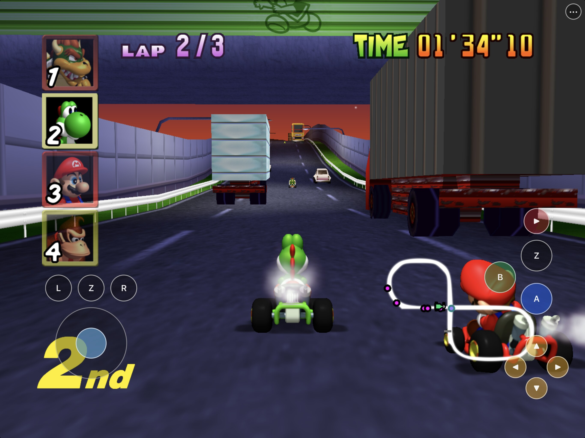
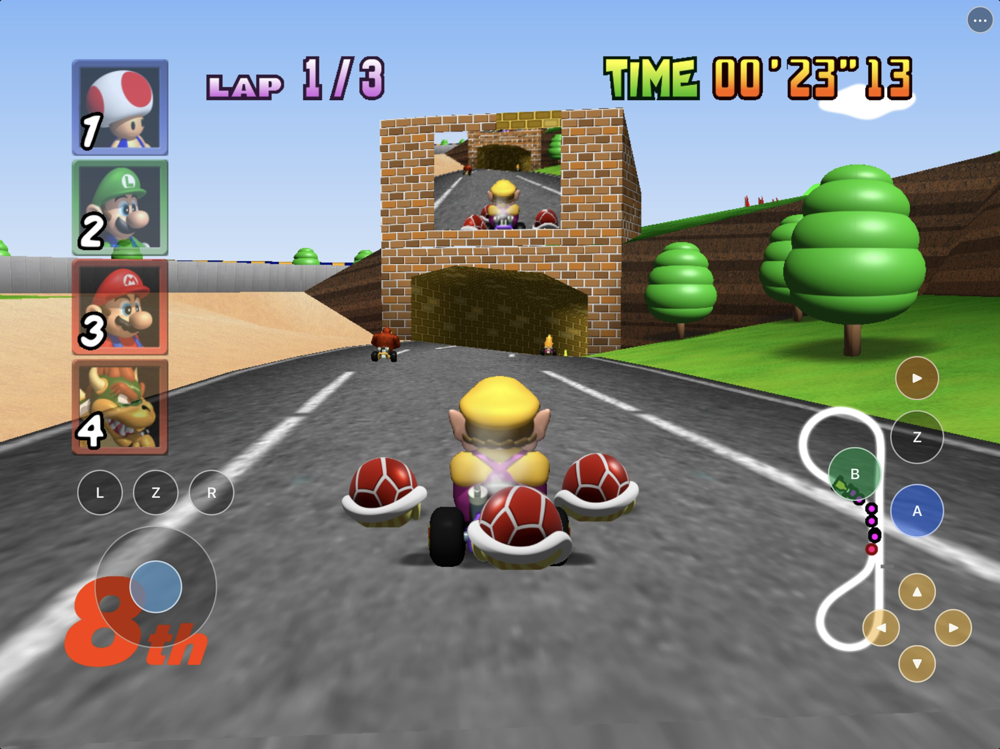
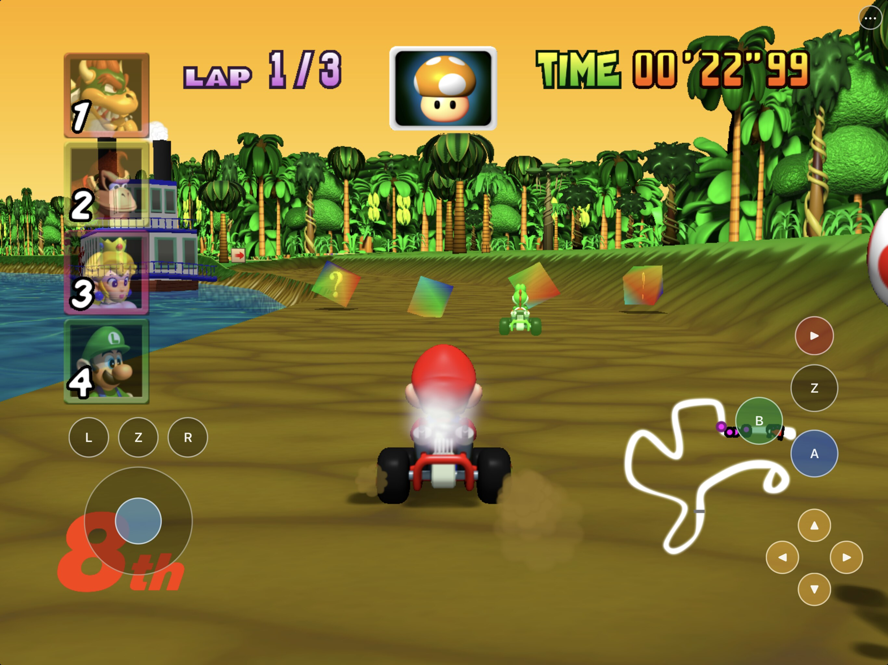
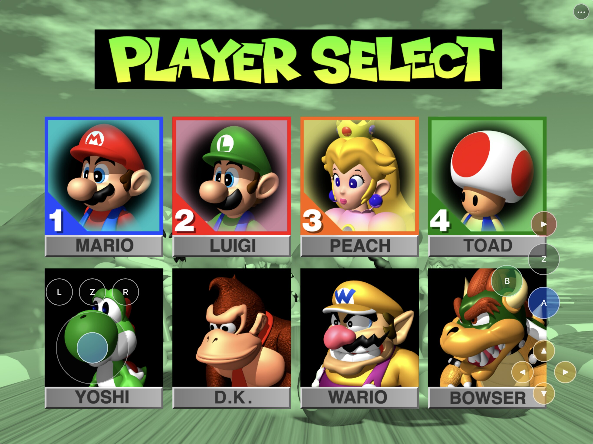
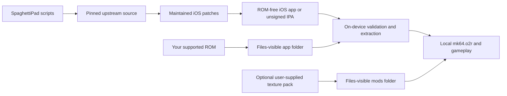

# SpaghettiPad

<p align="center">
  <strong>Mario Kart 64 on iPhone and iPad—with touch controls made for racing.</strong><br>
  Native Metal rendering, full-analog steering, local multiplayer foundations,
  and built-in support for optional enhanced texture packs.
</p>

<p align="center">
  <a href="https://github.com/chrissotraidis/spaghettipad/actions/workflows/ios-build.yml"></a>
  
  
  
  
  
  
</p>



SpaghettiPad packages the full
[SpaghettiKart](https://github.com/HarbourMasters/SpaghettiKart) source port
as a native iOS/iPadOS app. It brings Mario Kart 64 to the screen in your
hands with Metal rendering, true analog touch steering, a grip-first control
layout, Files-based setup, controller routing, and optional enhanced visuals.

This repository contains the mobile integration, maintained patches, and
reproducible build scripts. It does **not** contain Mario Kart 64, a ROM,
Nintendo assets, a playable ROM-derived archive, or MK64 Reloaded. Read the
scoped [rights and licensing boundary](RIGHTS_AND_LICENSES.md); it does not
relicense SpaghettiKart, its dependencies, texture packs, or game material.

## Built for racing on glass

The touch layout keeps the controls under your thumbs and the race visible.
The left side puts L, Z, and R above a full-analog stick. The right side keeps
A held for acceleration while a second Z stays available for items. Start is
deliberately separated from the action controls.

Touch is not painted over the whole display: empty space still belongs to the
game, the settings menu hides the race controls while open, and the persistent
`•••` button always provides a way back.

## Current screenshots

<table>
  <tr>
    <td width="50%">
      
    </td>
    <td width="50%">
      
    </td>
  </tr>
  <tr>
    <td align="center"><strong>Every race control, within reach</strong><br>Hold A, steer with full analog input, drift with R, and fire items from either Z.</td>
    <td align="center"><strong>Enhanced tracks, native workflow</strong><br>Import a compatible HD pack through Files and switch between original and enhanced graphics in-app.</td>
  </tr>
</table>

These are current physical-iPad captures using locally supplied game data.
The ROM and optional texture pack used to create them are not part of this
repository.

## Local multiplayer is part of the port



SpaghettiPad carries four N64 controller ports, deterministic connection-order
assignment, and SpaghettiKart's split-screen modes into the native iOS build.
The touch controller parks itself when hardware controllers are present and
returns after the last one disconnects.

Four-player selection is working, and two-player split-screen rendering has
been exercised. Full physical-controller Grand Prix, VS, battle, reconnect,
and sustained three/four-player performance remain documented hardware gates;
the README does not turn a working menu into an unearned compatibility claim.

## Enhanced textures, built into the experience

Optional texture packs are first-class app content, not a manual desktop
patch. Copy a compatible SpaghettiKart `.o2r` into the Files-visible `mods`
folder, relaunch, then use **Enhancements → Texture Packs** to choose original
or enhanced graphics. SpaghettiPad reports whether the pack is missing,
detected, loaded, enabled, or waiting for a relaunch.

[MK64 Reloaded](https://evilgames.eu/texture-packs/mk64-reloaded.htm) HD has
been imported and rendered on a physical iPad. No texture pack is bundled,
downloaded, mirrored, or redistributed by this project.

## Install status

| Option | Status | What to do |
|---|---|---|
| Local iPhone/iPad build | **Available now** | Build and sign with your own Apple development team by following [Build from source](docs/BUILDING.md). |
| Simulator | **Available now** | Use it for development and UI testing. It cannot replace physical-device acceptance. |
| Developer-preview `.ipa` | **Not published yet** | The repository can create an audited ROM-free unsigned IPA for personal re-signing; no public download is linked until a release artifact is actually published. |
| App Store / TestFlight | **Not announced** | No App Store listing or public TestFlight exists. |

The current development build has been signed, update-installed, and played
on a physical iPad. Files import, local `mk64.o2r` loading, touch gameplay,
menus, audio, saves, local multiplayer paths, and MK64 Reloaded HD have all
been exercised on that hardware.

Those results do not certify every configuration. Physical iPhone play,
Bluetooth-controller mapping and reconnect behavior, sustained multiplayer
performance, a complete tilt-driven Grand Prix, and the final audited release
artifact remain explicit validation gates.

## Get started

You need:

- a Mac with Xcode and its command-line tools;
- [Homebrew](https://brew.sh);
- an Apple ID configured in Xcode for physical-device signing; and
- your own legally acquired Mario Kart 64 **US 1.0, big-endian `.z64`** ROM.

The supported ROM has SHA-1:

```text
579c48e211ae952530ffc8738709f078d5dd215e
```

Install the host dependencies:

```sh
brew install cmake ninja pkgconf sdl2 glew nlohmann-json libpng libzip \
  tinyxml2 libogg libvorbis opus opusfile sdl2_net ripgrep
```

Clone and build:

```sh
git clone https://github.com/chrissotraidis/spaghettipad.git
cd spaghettipad

# Simulator
scripts/build-ios.sh --simulator

# Physical iPhone or iPad
DEVELOPMENT_TEAM=ABCDE12345 \
BUNDLE_ID=com.yourname.spaghettipad \
scripts/build-ios.sh --device
```

Replace `ABCDE12345` with the 10-character team identifier shown in Xcode and
use a bundle identifier that belongs to you. Keep that bundle identifier
unchanged for later update installs so iOS can retain the app container.

The device app is written to:

```text
build-ios/Release-iphoneos/SpaghettiPad.app
```

If Xcode needs to register the device or create a provisioning profile, open
`build-ios/Spaghettify.xcodeproj`, select the `Spaghettify` scheme and your
device, then choose your team under **Signing & Capabilities**.

See [the complete build guide](docs/BUILDING.md) for pinned-source,
package-audit, and signing details. Before sharing a source snapshot or build,
follow the [release checklist](docs/RELEASE_CHECKLIST.md).

## First launch

SpaghettiPad never downloads or bundles game data.

1. Launch SpaghettiPad once so iOS creates its Files-visible folder.
2. Open **Files → On My iPad/iPhone → SpaghettiPad**.
3. Move your supported `.z64` into that folder.
4. Return to SpaghettiPad and tap **Rescan**.
5. Keep the app open while it validates the ROM and creates local
   `mk64.o2r`.
6. Relaunch if instructed, then press the on-screen Start button.

The ROM and generated game archive remain in the app container. They are
ignored by Git and rejected by the repository's app and package audits.

Maintainers may instead use `scripts/generate-port-archive.sh` to create a
local `ref/mk64.o2r`, then copy that archive into the installed app's
Files-visible folder. `ref/` is ignored local storage; never commit or upload
its contents.

## Touch controls

The current controller is arranged for landscape play:

- **Left:** equal-size L, Z, and R buttons above the full-analog control stick.
- **Right:** Start above the second Z, plus A, B, and the four C buttons.
- **Menu:** the persistent `•••` button opens settings and stays reachable
  when gameplay controls are hidden.
- **Touch toggle:** use **Settings → Controls → Touch Controls** to hide or
  restore the gameplay overlay.
- **Tilt:** opt-in steering, sensitivity, and recenter controls are under
  **Settings → Controls**.

The touch D-pad is intentionally omitted because Mario Kart 64's normal racing
controls do not use it. Two Z buttons are provided so an item can be used
while A remains held for acceleration. Opening the menu hides the gameplay
controls; closing it restores them only when Touch Controls is enabled.

| Touch control | Mario Kart 64 action |
|---|---|
| Analog stick | Steer and navigate |
| A | Accelerate / confirm |
| B | Brake, reverse / cancel |
| Z | Use or hold an item |
| R | Hop, drift, and powerslide |
| L | Cycle the race display |
| Start | Pause / start |
| C buttons | Camera and display controls used by the game |
| `•••` | Open or close the SpaghettiKart menu |

## Physical controllers

SpaghettiPad includes SpaghettiKart/libultraship's SDL game-controller input
path and a pinned controller mapping database. The iOS integration installs
default SDL mappings for all four N64 ports. Controllers are assigned by
connection order: first to player 1, second to player 2, through player 4.
When a physical controller is detected, the touch gameplay overlay parks so it
does not send duplicate player-1 input; it returns after the last controller
disconnects.

The default extended-gamepad layout is:

| Physical control | Mario Kart 64 input |
|---|---|
| Left stick | Analog stick / steering |
| South face button (`A` on Xbox) | A / accelerate |
| West face button (`X` on Xbox) | B / brake and reverse |
| Left trigger | Z / use or hold item |
| Right shoulder or trigger | R / hop and drift |
| Left shoulder | L |
| Menu/Start | Start |
| Right stick up/right | C-up/C-right |
| North/east face buttons | C-left/C-down |
| D-pad | N64 D-pad |

That describes the implemented path, not a blanket hardware certification.
Automatic button mapping, reconnect behavior, rumble, and sustained
one-to-four-player sessions still require physical testing across Xbox,
PlayStation, Nintendo, and MFi controller models. See
[Physical-device acceptance](docs/HARDWARE_ACCEPTANCE.md) for the exact gate.

## Texture packs

SpaghettiPad supports compatible SpaghettiKart `.o2r` texture packs but does
not provide, download, mirror, or relicense them. To use
[MK64 Reloaded](https://evilgames.eu/texture-packs/mk64-reloaded.htm):

1. Download the **SpaghettiKart HD `.o2r`** from the author's official page.
2. In Files, create or open
   **On My iPad/iPhone → SpaghettiPad → mods**.
3. Move the `.o2r` into `mods`.
4. Relaunch SpaghettiPad once so the engine can load the new archive.
5. Open **••• → Enhancements → Texture Packs**.
6. Confirm the status says the pack is loaded, then use
   **Use Enhanced / HD Texture Pack**.

Adding or replacing an archive requires one relaunch. Turning the imported
pack on or off also requires a restart because the engine mounts the archive
when it starts; the app explains that current race progress will be lost,
saves the selection, and closes only after you confirm. Reopen SpaghettiPad
manually from the Home Screen; iOS does not allow an app to relaunch itself.
Cancel leaves the running state unchanged. The Texture Packs page reports
whether a pack is absent, detected but awaiting a relaunch, loaded and off,
loaded and on, or waiting to apply a change. Start with HD. Treat 4K as an
M-series-iPad performance experiment until it has its own hardware evidence.

## Current validation

| Area | Current result |
|---|---|
| Native app | arm64 iPhoneOS and arm64 Simulator builds target iOS/iPadOS 15+ |
| Rendering | Metal rendering works in Simulator and on a physical iPad |
| Game setup | Files-visible supported-ROM import and local `mk64.o2r` loading work |
| Touch | Analog steering and race controls have been exercised on a physical iPad; full acceptance still requires the documented touch-only GP |
| Texture packs | MK64 Reloaded HD has been imported, loaded, and rendered on a physical iPad; full-GP performance evidence remains |
| Saves and updates | Development update installs have retained the current app container; the final audited update/save-preservation gate remains |
| Controllers | Four-port routing and split-screen rendering pass deterministic Simulator tests; physical model, reconnect, and multiplayer sessions remain |
| Tilt | The persisted motion-to-stick path, recentering, touch priority, and foreground recalibration pass Simulator tests; physical feel and a tilt GP remain |
| Packaging | ROM/game-data exclusions, signed/unsigned checks, and reproducible local unsigned IPA creation are implemented |
| CI | Consult the live workflow badge and Actions run; local success is not reported as green hosted CI |

The project deliberately keeps build, Simulator, process, and physical-device
evidence separate. The [remaining-work ledger](docs/remaining-work.md) records
the detailed proof and open gates.

## Supported game

| Game | Engine | Status |
|---|---|---|
| **Mario Kart 64 US 1.0** | [SpaghettiKart](https://github.com/HarbourMasters/SpaghettiKart) | Supported |
| Other Nintendo 64 games or ROM revisions | Other source ports/emulators | Not supported by this app |

SpaghettiPad is a native integration of one source port, not a general
Nintendo 64 emulator. A different game or ROM revision cannot be substituted.

## Reproducible and ROM-free



The normal compile never reads your ROM. `scripts/build-ios.sh` fetches exact
upstream revisions, disables their push URLs, applies the maintained patches,
generates the ROM-free `spaghetti.o2r`, and builds the app. Your game data is
introduced only after installation.

To create an unsigned, re-signable preview package from the current device
build:

```sh
scripts/package-ios.sh
```

The packager audits the bundle and rejects Simulator products, original ROMs,
ROM-derived `mk64*.o2r`/`.otr` files, imported texture packs, unexpected port
archive contents, and stale signing material. The public package contract is
an unsigned IPA that the installer signs with their own Apple ID; do not
distribute a maintainer development profile.

## Frequently asked questions

<details>
<summary><strong>Where is the IPA?</strong></summary>

No public IPA is linked yet. You can build the project locally or create an
audited unsigned package with `scripts/package-ios.sh`. When an actual release
asset exists, this README and [the installation guide](docs/INSTALL_IPA.md)
will link to that exact release and checksum.
</details>

<details>
<summary><strong>Does this repository include Mario Kart 64?</strong></summary>

No. You must provide your own legally acquired supported ROM. Do not open
issues requesting game data, extracted assets, or download links.
</details>

<details>
<summary><strong>Does it support Bluetooth controllers?</strong></summary>

The native SDL controller path, mapping database, and four-player port routing
are included. Physical controller models and reconnect behavior are still
being verified, so support is not yet advertised as universal.
</details>

<details>
<summary><strong>Can the HD texture pack be bundled with SpaghettiPad?</strong></summary>

No. Texture packs remain optional third-party content obtained by the user
from the pack author's official page. SpaghettiPad only provides the Files
import and enable/disable workflow.
</details>

<details>
<summary><strong>Does SpaghettiPad require JIT or a jailbreak?</strong></summary>

No. It is a native arm64 source-port build. A sideloaded IPA still requires
normal iOS code signing, but gameplay does not require JIT.
</details>

<details>
<summary><strong>Is this an App Store or TestFlight release?</strong></summary>

No. App Store, TestFlight, AltStore PAL, AltStore Classic, and SideStore
distribution have different signing, review, account, and regional
requirements. None should be implied until that exact path is published and
tested.
</details>

<details>
<summary><strong>What is the licensing status?</strong></summary>

Each upstream component retains its own license and copyright. This repository
has the narrower terms described in
[RIGHTS_AND_LICENSES.md](RIGHTS_AND_LICENSES.md); public source access does not
grant rights to Nintendo material or third-party texture packs.
</details>

## Project map

| Path | Purpose |
|---|---|
| [`scripts/build-ios.sh`](scripts/build-ios.sh) | Complete Simulator or device build |
| [`scripts/generate-port-archive.sh`](scripts/generate-port-archive.sh) | Local-only ROM validation and `mk64.o2r` generation |
| [`scripts/package-ios.sh`](scripts/package-ios.sh) | Audited unsigned/signed IPA packaging |
| [`scripts/check-repo-safety.sh`](scripts/check-repo-safety.sh) | Tracked-asset, history, patch, script, and documentation gate |
| [`patches/`](patches/) | Reviewable SpaghettiPad changes replayed onto pinned upstream source |
| [`docs/screenshots/README.md`](docs/screenshots/README.md) | Current physical-iPad screenshot gallery and capture notes |
| [`docs/BUILDING.md`](docs/BUILDING.md) | Full build, signing, and package-audit guide |
| [`docs/INSTALL_IPA.md`](docs/INSTALL_IPA.md) | Unsigned developer-preview installation boundary |
| [`docs/HARDWARE_ACCEPTANCE.md`](docs/HARDWARE_ACCEPTANCE.md) | Physical-device validation workflow |
| [`docs/RELEASE_CHECKLIST.md`](docs/RELEASE_CHECKLIST.md) | Source and IPA publication gates |
| [`docs/remaining-work.md`](docs/remaining-work.md) | Evidence ledger and remaining gates |
| [`RIGHTS_AND_LICENSES.md`](RIGHTS_AND_LICENSES.md) | Project, upstream, and game-data rights boundary |

Generated source trees, builds, artifacts, ROMs, ROM-derived archives, texture
packs, device evidence, and signing identifiers are ignored and must never be
committed.

## Credits and legal

SpaghettiPad exists because of
[SpaghettiKart](https://github.com/HarbourMasters/SpaghettiKart),
[libultraship](https://github.com/Kenix3/libultraship),
[Torch](https://github.com/HarbourMasters/Torch), SDL, and their contributors.
Its mobile control work also draws on lessons from
[HarkinianPad](https://github.com/chrissotraidis/harkinianpad), while
[MK64 Reloaded](https://evilgames.eu/texture-packs/mk64-reloaded.htm) is an
independent, optional user-supplied visual pack.

SpaghettiPad is an unofficial community project and is not affiliated with or
endorsed by Nintendo, Harbour Masters, or the MK64 Reloaded project. Nintendo,
Mario, and Mario Kart are trademarks of Nintendo. All projects, copyrights,
and trademarks belong to their respective owners.
